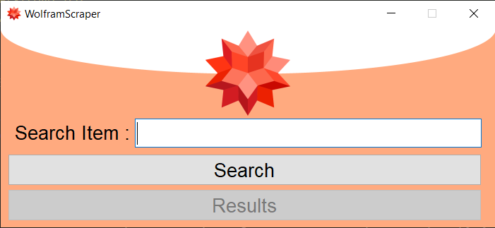
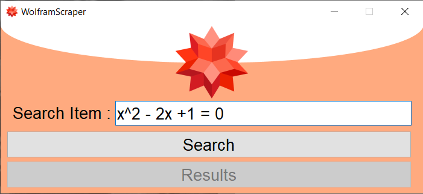
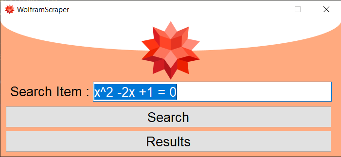
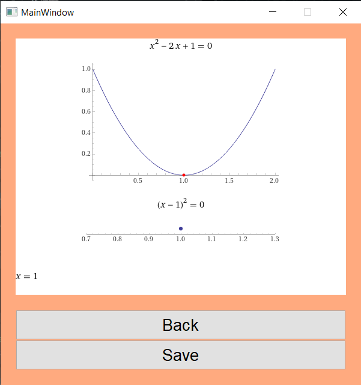

# WolframAlpha Scraper

## Overview

The Wolfram Scraper allows you to create a simple and comprehensive image to answer all your questions.

It allows you to enter a search term, and it combines all the answers it can find on WolframAlpha ito a single image.

<br />

## Prerequisites
- You will need a working installation of python.
- The following packages will need to be installed, preferably in a venv(see [Creating a venv](./README.md#creating-a-venvoptional)):
    - PyQt5 (```pip install PyQt5```)
    - requests (```pip install requests```)
    - selenium (```pip install selenium```)
    - PIL (```pip install Pillow```)
    

<br />

## Creating a venv(Optional)
- A venv or virtual environment is a tool that can be used to manage all your installed packages.
- You can create a venv in the terminal by moving to the directory where the project folder is located  
and using the command ```python -m venv <give-your-venv-a-name-here>```
    - Note that depending on your operating system, you might have to replace ```python``` with ```python3```.

<br />

## How To Use

Simply start up the program and enter your search query in the text box and press search.
<br />
<br />
<p>You will notice that the logo starts spinning, indicating that it is waiting for the data to be fetched</p><br />
<br />
<p>CLick on Results to view the compiled image.</p><br />
<br />
<p>You can also click save to save the image to disk.</p><br />

